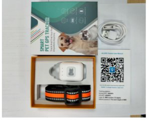

# 🐾 Paw Tracker - Landing Page

Landing page profesional y de alta conversión para Paw Tracker, un sistema GPS inteligente para mascotas.

## 📋 Características

- ✨ Diseño moderno y responsive
- 🎬 Sección de video embebida
- 📍 Descripción de características y especificaciones
- 💰 Sección de precios con descuentos
- 📝 Formulario de contacto integrado
- 🔗 Botón de compra con Stripe
- 📱 Optimizado para móvil y desktop

## 📂 Estructura del Proyecto

```
paw-tracker-landing/
├── paw-tracker-landing.html    # Archivo principal (HTML + CSS + JS integrados)
├── 1780001653836_image.png     # Imagen del producto
├── e_c_b_c_mp_.mp4            # Video del producto
├── package.json                 # Configuración npm
├── netlify.toml                 # Configuración Netlify
├── .gitignore                   # Archivos a ignorar en Git
└── README.md                    # Este archivo
```

## 🚀 Cómo Deployar en Netlify

### Opción 1: Conectar tu repositorio Git (Recomendado)

1. **Crear un repositorio en GitHub**
   - Ve a [GitHub.com](https://github.com) y crea un nuevo repositorio
   - Llámalo `paw-tracker-landing`
   - No agregues README, gitignore, ni licencia (se agregarán localmente)

2. **Configurar Git localmente** (si no tienes Git instalado, descárgalo)
   ```bash
   cd tu-carpeta-del-proyecto
   git init
   git add .
   git commit -m "Initial commit: Paw Tracker landing page"
   git branch -M main
   git remote add origin https://github.com/tu-usuario/paw-tracker-landing.git
   git push -u origin main
   ```

3. **Conectar a Netlify**
   - Ve a [Netlify.com](https://netlify.com)
   - Inicia sesión o crea una cuenta
   - Click en "New site from Git"
   - Selecciona "GitHub" y autoriza
   - Selecciona el repositorio `paw-tracker-landing`
   - Click en "Deploy site"

4. **Configurar dominio personalizado (opcional)**
   - En Netlify, ve a "Site settings" > "Domain settings"
   - Click en "Add custom domain"
   - Sigue las instrucciones para configurar tu dominio

### Opción 2: Drag & Drop (Más rápido para probar)

1. Descarga todos los archivos
2. Ve a [Netlify.com](https://netlify.com)
3. Arrastra y suelta la carpeta en la sección "Deploy"
4. Listo! Tu sitio estará en línea en segundos

## 🔄 Actualizar Contenido

Después de hacer cambios en los archivos:

```bash
git add .
git commit -m "Descripción de cambios"
git push origin main
```

Netlify detectará los cambios automáticamente y desplegará la nueva versión.

## ✏️ Cómo Personalizar

### Cambiar el Logo/Nombre
En `paw-tracker-landing.html`, busca:
```html
<div class="logo">
    <span>🐾</span> Paw Tracker
</div>
```

### Cambiar Precios
Busca la sección "Pricing":
```html
<div class="price-original">Precio Regular: $250</div>
<div class="price-current">$102</div>
```

### Cambiar Email para Contacto
Busca en el archivo HTML:
```javascript
`mailto:marceardila@gmail.com`
```

### Cambiar Link de Stripe
Busca:
```html
href="https://buy.stripe.com/aFa9ASaiP343fIO6HWaEE03"
```

### Cambiar Imágenes y Videos
Asegúrate de que los archivos estén en la misma carpeta y actualiza las rutas:
```html

<video src="e_c_b_c_mp_.mp4"></video>
```

## 📧 Formulario de Contacto

El formulario actualmente abre el cliente de email. Para una solución más robusta, puedes usar:

**Opción 1: Formspree**
1. Ve a [Formspree.io](https://formspree.io)
2. Crea una cuenta
3. Reemplaza el formulario con el código que te proporciona

**Opción 2: EmailJS**
```javascript
// En el script del formulario, reemplaza con:
emailjs.send('service_id', 'template_id', {
    to_email: 'marceardila@gmail.com',
    from_name: name,
    from_email: email,
    message: message
});
```

## 🎨 Personalización de Colores

En el archivo HTML, busca las variables CSS:
```css
:root {
    --primary: #FF6B5B;      /* Color rojo/naranja principal */
    --secondary: #2D3436;    /* Color oscuro */
    --accent: #00B894;       /* Color verde de acento */
    --light-bg: #FAFBFC;     /* Fondo claro */
}
```

Cámbialas a tus colores preferidos.

## 📱 Optimización

El sitio está optimizado para:
- ✅ Dispositivos móviles
- ✅ Tablets
- ✅ Desktops
- ✅ Velocidad de carga rápida
- ✅ SEO básico

## 🔒 Seguridad

El archivo `netlify.toml` incluye headers de seguridad estándar.

## 💡 Tips de Conversión

1. **Mantén el CTA (Call to Action) visible** - El botón "Comprar" está en varias secciones
2. **Social proof** - Considera agregar testimonios de clientes
3. **Urgencia** - Considera agregar "Oferta limitada"
4. **Mobile first** - El diseño prioriza móviles

## 🆘 Soporte

Para preguntas sobre Netlify: [docs.netlify.com](https://docs.netlify.com)
Para preguntas sobre el código: Contacta a tu desarrollador

## 📄 Licencia

MIT

---

**Hecho con ❤️ para tu negocio de Paw Tracker**
